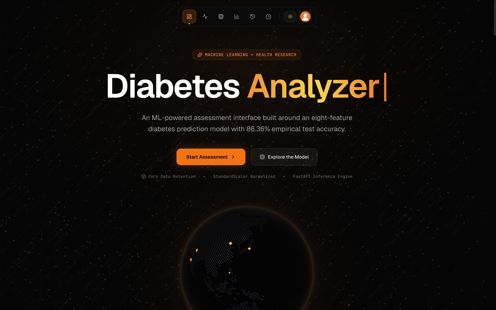

<div align="center">


<br/>


<br/><br/>

<a href="https://frontendmlp.vercel.app/">
  
</a>
&nbsp;
<a href="https://github.com/Sakshamxx/MLP-Diabetes_Detection">
  
</a>

</div>


<div align="center">

## Interface Preview



</div>


<div align="center">

## Tech Stack

<div align="center">


</div>

</div>


<div align="center">

## Pipeline & Architecture

<table>
<tr><td align="center" style="background-color:#1A1A1A; color:#FFFFFF; padding:14px 28px; border-radius:10px; font-weight:600;">User Input <sub>(React + Vite)</sub></td></tr>
<tr><td align="center" style="color:#E5383B; font-size:20px;">↓</td></tr>
<tr><td align="center" style="background-color:#E5383B; color:#FFFFFF; padding:14px 28px; border-radius:10px; font-weight:600;">FastAPI Backend</td></tr>
<tr><td align="center" style="color:#E5383B; font-size:20px;">↓</td></tr>
<tr><td align="center" style="background-color:#1A1A1A; color:#FFFFFF; padding:14px 28px; border-radius:10px; font-weight:600;">StandardScaler <sub>(fit on X_train)</sub></td></tr>
<tr><td align="center" style="color:#E5383B; font-size:20px;">↓</td></tr>
<tr><td align="center" style="background-color:#E5383B; color:#FFFFFF; padding:14px 28px; border-radius:10px; font-weight:600;">MLPClassifier <sub>16 neurons · ReLU · Adam</sub></td></tr>
<tr><td align="center" style="color:#E5383B; font-size:20px;">↓</td></tr>
<tr><td align="center" style="background-color:#1A1A1A; color:#FFFFFF; padding:14px 28px; border-radius:10px; font-weight:600;">Prediction <sub>Diabetic / Non-diabetic</sub></td></tr>
</table>

</div>


<div align="center">

## Installation

</div>

```bash
git clone https://github.com/Sakshamxx/MLP-Diabetes_Detection.git
cd MLP-Diabetes_Detection

# Backend
cd Backend && python3 -m venv venv && source venv/bin/activate
pip install -r requirements.txt
uvicorn app:app --reload

# Frontend (new terminal)
cd Frontend && npm install && npm run dev
```


<div align="center">

## Author


**Saksham Chauhan**

[](https://github.com/Sakshamxx)
[](https://www.linkedin.com/in/saksham-chauhan-b18bb5277/)
[](mailto:sakshamchauhan003@gmail.com)

</div>

<div align="center">

</div>
